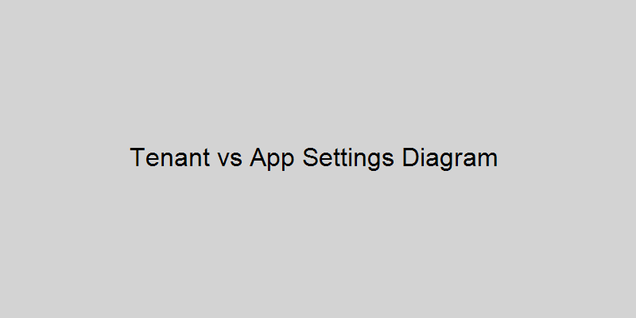

# Tenant vs Application Level Settings

## Overview
Azure AD settings can be applied at:
- **Tenant Level:** Applies to all applications in the tenant.
- **Application Level:** Specific to a single application.

## Diagram

